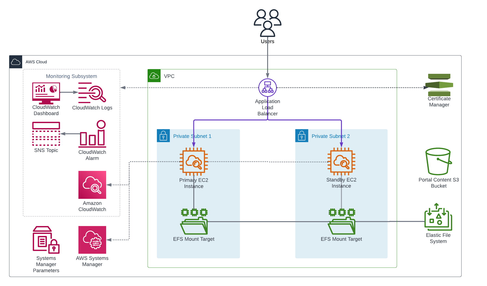

<!-- BEGIN_TF_DOCS -->
# Infrastructure Terraform Module for Base ArcGIS Enterprise on Linux

The Terraform module provisions AWS resources for highly available base ArcGIS Enterprise deployment on Linux platform.

  

The module launches two SSM managed EC2 instances in the private or isolated VPC subnets created by infrastructure-core Terraform module.
The instances are launched from image retrieved from '/arcgis/${var.site_id}/images/${var.os}/${var.deployment_id}' SSM parameter.
The image must be created by the Packer Template for Base ArcGIS Enterprise on Linux.

For the EC2 instances the module creates records in the VPC Route53 private hosted zone to make the instancess addressable using permanent DNS names like `primary.arcgis-enterprise-base.arcgis-enterprise.internal`.

> Note that the EC2 instance will be terminated and recreated if the infrastructure terraform module is applied again after the SSM parameter value was modified by a new image build.

The module creates:
* An Application Load Balancer in the public subnets with HTTPS listeners for ports 80, 443, 6443, and 7443 as well as target groups for those listeners that target the EC2 instances.
* An SNS topic and a CloudWatch alarms that monitor the target groups and post to the SNS topic if the number of unhelathy instances in nonzero.
* A CloudWatch log group and configures CloudWatch agent on the EC2 instances to send the system and Chef run logs to the log group as well as monitor memory and disk utilization on the EC2 instances.
* A CloudWatch dashboard that displays the CloudWatch alerts, metrics and logs of the deployment.
* An EFS file system and mounts it to the EC2 instances.

All the created AWS resources are tagged with ArcGISSiteId and ArcGISDeploymentId tags.

## Requirements

On the machine where Terraform is executed:

* Python 3.8 or later with [AWS SDK for Python (Boto3)](https://aws.amazon.com/sdk-for-python/) package must be installed.
* Path to aws/scripts directory must be added to PYTHONPATH.
* AWS credentials must be configured.
* AWS region must be specified by AWS_DEFAULT_REGION environment variable.

Before creating the infrastructure, an SSL certificate for the base ArcGIS Enterprise deployment domain name
must be imported into or issued by AWS Certificate Manager service in the AWS account. The certificate's
ARN specified by "ssl_certificate_arn" input variable will be used to configure HTTPS listeners of the load balancer.

After creating the infrastructure, the domain name must be pointed to the DNS name of Application Load Balancer
exported by "alb_dns_name" output value of the module.

## Troubleshooting

Use Session Manager connection in AWS Console for SSH access to the EC2 instances.

The SSM commands output stored in the logs S3 bucket is copied in the Trerraform stdout.

## SSM Parameters

The module uses the following SSM parameters:

| SSM parameter name | Description |
|--------------------|-------------|
| /arcgis/${var.site_id}/iam/instance-profile-name | IAM instance profile name |
| /arcgis/${var.site_id}/images/${var.os}/${var.deployment_id} | Id of the built AMI |
| /arcgis/${var.site_id}/s3/logs | S3 bucket for SSM commands output |
| /arcgis/${var.site_id}/vpc/${var.subnet_type}-subnet-1 | VPC subnet 1 Id |
| /arcgis/${var.site_id}/vpc/${var.subnet_type}-subnet-2 | VPC subnet 2 Id |
| /arcgis/${var.site_id}/vpc/hosted-zone-id | VPC hosted zone Id |
| /arcgis/${var.site_id}/vpc/id | VPC Id |

## Providers

| Name | Version |
|------|---------|
| aws | ~> 5.22 |

## Modules

| Name | Source | Version |
|------|--------|---------|
| cw_agent | ../../modules/cw_agent | n/a |
| dashboard | ../../modules/dashboard | n/a |
| nfs_mount | ../../modules/nfs_mount | n/a |
| portal_http_alb_target | ../../modules/alb_target_group | n/a |
| portal_https_alb_target | ../../modules/alb_target_group | n/a |
| private_portal_https_alb_target | ../../modules/alb_target_group | n/a |
| private_server_https_alb_target | ../../modules/alb_target_group | n/a |
| security_group | ../../modules/security_group | n/a |
| server_http_alb_target | ../../modules/alb_target_group | n/a |
| server_https_alb_target | ../../modules/alb_target_group | n/a |

## Resources

| Name | Type |
|------|------|
| [aws_efs_file_system.fileserver](https://registry.terraform.io/providers/hashicorp/aws/latest/docs/resources/efs_file_system) | resource |
| [aws_efs_mount_target.primary](https://registry.terraform.io/providers/hashicorp/aws/latest/docs/resources/efs_mount_target) | resource |
| [aws_efs_mount_target.standby](https://registry.terraform.io/providers/hashicorp/aws/latest/docs/resources/efs_mount_target) | resource |
| [aws_instance.primary](https://registry.terraform.io/providers/hashicorp/aws/latest/docs/resources/instance) | resource |
| [aws_instance.standby](https://registry.terraform.io/providers/hashicorp/aws/latest/docs/resources/instance) | resource |
| [aws_lb.alb](https://registry.terraform.io/providers/hashicorp/aws/latest/docs/resources/lb) | resource |
| [aws_lb_listener.arcgis_portal_https](https://registry.terraform.io/providers/hashicorp/aws/latest/docs/resources/lb_listener) | resource |
| [aws_lb_listener.arcgis_server_https](https://registry.terraform.io/providers/hashicorp/aws/latest/docs/resources/lb_listener) | resource |
| [aws_lb_listener.http](https://registry.terraform.io/providers/hashicorp/aws/latest/docs/resources/lb_listener) | resource |
| [aws_lb_listener.https](https://registry.terraform.io/providers/hashicorp/aws/latest/docs/resources/lb_listener) | resource |
| [aws_lb_target_group.default](https://registry.terraform.io/providers/hashicorp/aws/latest/docs/resources/lb_target_group) | resource |
| [aws_route53_record.primary](https://registry.terraform.io/providers/hashicorp/aws/latest/docs/resources/route53_record) | resource |
| [aws_route53_record.standby](https://registry.terraform.io/providers/hashicorp/aws/latest/docs/resources/route53_record) | resource |
| [aws_s3_bucket.portal_content](https://registry.terraform.io/providers/hashicorp/aws/latest/docs/resources/s3_bucket) | resource |
| [aws_security_group.arcgis_alb](https://registry.terraform.io/providers/hashicorp/aws/latest/docs/resources/security_group) | resource |
| [aws_security_group_rule.allow_arcgis_portal_https](https://registry.terraform.io/providers/hashicorp/aws/latest/docs/resources/security_group_rule) | resource |
| [aws_security_group_rule.allow_arcgis_server_https](https://registry.terraform.io/providers/hashicorp/aws/latest/docs/resources/security_group_rule) | resource |
| [aws_security_group_rule.allow_http](https://registry.terraform.io/providers/hashicorp/aws/latest/docs/resources/security_group_rule) | resource |
| [aws_security_group_rule.allow_https](https://registry.terraform.io/providers/hashicorp/aws/latest/docs/resources/security_group_rule) | resource |
| [aws_ssm_parameter.alb_security_group_id](https://registry.terraform.io/providers/hashicorp/aws/latest/docs/resources/ssm_parameter) | resource |
| [aws_ssm_parameter.portal_content_s3_bucket](https://registry.terraform.io/providers/hashicorp/aws/latest/docs/resources/ssm_parameter) | resource |
| [aws_ami.ami](https://registry.terraform.io/providers/hashicorp/aws/latest/docs/data-sources/ami) | data source |
| [aws_region.current](https://registry.terraform.io/providers/hashicorp/aws/latest/docs/data-sources/region) | data source |
| [aws_ssm_parameter.alb_subnet_1](https://registry.terraform.io/providers/hashicorp/aws/latest/docs/data-sources/ssm_parameter) | data source |
| [aws_ssm_parameter.alb_subnet_2](https://registry.terraform.io/providers/hashicorp/aws/latest/docs/data-sources/ssm_parameter) | data source |
| [aws_ssm_parameter.ami](https://registry.terraform.io/providers/hashicorp/aws/latest/docs/data-sources/ssm_parameter) | data source |
| [aws_ssm_parameter.hosted_zone_id](https://registry.terraform.io/providers/hashicorp/aws/latest/docs/data-sources/ssm_parameter) | data source |
| [aws_ssm_parameter.instance_profile_name](https://registry.terraform.io/providers/hashicorp/aws/latest/docs/data-sources/ssm_parameter) | data source |
| [aws_ssm_parameter.primary_subnet](https://registry.terraform.io/providers/hashicorp/aws/latest/docs/data-sources/ssm_parameter) | data source |
| [aws_ssm_parameter.s3_repository](https://registry.terraform.io/providers/hashicorp/aws/latest/docs/data-sources/ssm_parameter) | data source |
| [aws_ssm_parameter.standby_subnet](https://registry.terraform.io/providers/hashicorp/aws/latest/docs/data-sources/ssm_parameter) | data source |
| [aws_ssm_parameter.vpc_id](https://registry.terraform.io/providers/hashicorp/aws/latest/docs/data-sources/ssm_parameter) | data source |

## Inputs

| Name | Description | Type | Default | Required |
|------|-------------|------|---------|:--------:|
| client_cidr_blocks | Client CIDR blocks | `list(string)` | ```[ "0.0.0.0/0" ]``` | no |
| deployment_id | ArcGIS Enterprise deployment Id | `string` | `"arcgis-enterprise-base"` | no |
| instance_type | EC2 instance type | `string` | `"m6i.2xlarge"` | no |
| key_name | EC2 key pair name | `string` | n/a | yes |
| os | Operating system id (rhel8\|rhel9\|ubuntu20\|ubuntu22\|sles15) | `string` | `"rhel8"` | no |
| root_volume_size | Root EBS volume size in GB | `number` | `1024` | no |
| site_id | ArcGIS Enterprise site Id | `string` | `"arcgis-enterprise"` | no |
| ssl_certificate_arn | SSL certificate ARN for HTTPS listeners of the load balancer | `string` | n/a | yes |
| subnet_type | Type of the EC2 instances subnets. Valid values are private and isolated. Default is private. | `string` | `"private"` | no |

## Outputs

| Name | Description |
|------|-------------|
| alb_dns_name | DNS name of the application load balancer |
| security_group_id | EC2 security group Id |
<!-- END_TF_DOCS -->